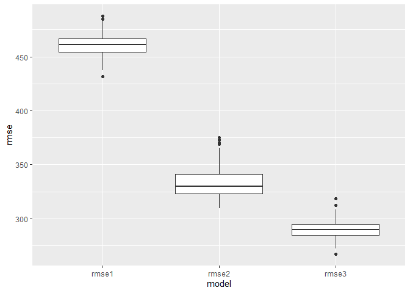

Homework 5
================
Yimiao Pang

## Problem 1

``` r
# load and clean - convert numeric to factor
bw_df = read_csv("./data/birthweight.csv") %>% 
  mutate(
    babysex = as.factor(babysex),
    frace = as.factor(frace),
    malform = as.factor(malform),
    mrace = as.factor(mrace)
  )
```

    ## Rows: 4342 Columns: 20

    ## -- Column specification --------------------------------------------------------
    ## Delimiter: ","
    ## dbl (20): babysex, bhead, blength, bwt, delwt, fincome, frace, gaweeks, malf...

    ## 
    ## i Use `spec()` to retrieve the full column specification for this data.
    ## i Specify the column types or set `show_col_types = FALSE` to quiet this message.

``` r
# check for missing data
which(is.na(bw_df))
```

    ## integer(0)

``` r
bw_df %>% 
  ggplot(aes(x = gaweeks, y = bwt)) +
  geom_point()
```

<!-- -->

``` r
bw_df %>% 
  ggplot(aes(x = ppwt, y = bwt)) +
  geom_point()
```

<!-- -->

It is hypothesized that the birth weight might increase as the
gestational age/mother’s pre-pregnancy weight increases. After observing
the relationships between bwt and gaweeks/ppwt through scatter plots,
there do exist positive correlations. Thus, we can try to set gaweeks
and ppwt as the predictors.

``` r
fit = lm(bwt ~ gaweeks + ppwt, data = bw_df)
summary(fit)
```

    ## 
    ## Call:
    ## lm(formula = bwt ~ gaweeks + ppwt, data = bw_df)
    ## 
    ## Residuals:
    ##      Min       1Q   Median       3Q      Max 
    ## -1708.16  -287.12    -0.28   294.43  1656.24 
    ## 
    ## Coefficients:
    ##             Estimate Std. Error t value Pr(>|t|)    
    ## (Intercept)  31.5699    95.2836   0.331     0.74    
    ## gaweeks      65.4518     2.2143  29.558   <2e-16 ***
    ## ppwt          4.0676     0.3465  11.740   <2e-16 ***
    ## ---
    ## Signif. codes:  0 '***' 0.001 '**' 0.01 '*' 0.05 '.' 0.1 ' ' 1
    ## 
    ## Residual standard error: 459.5 on 4339 degrees of freedom
    ## Multiple R-squared:  0.1955, Adjusted R-squared:  0.1951 
    ## F-statistic: 527.1 on 2 and 4339 DF,  p-value: < 2.2e-16

``` r
bw_df %>% 
  add_residuals(fit) %>% 
  ggplot(aes(x = gaweeks, y = resid)) +
  geom_point() + 
  geom_point(aes(x = ppwt, color = "red"))
```

<!-- -->

``` r
bw_df %>% 
  add_residuals(fit) %>% 
  ggplot(aes(x = resid)) +
  geom_density()
```

<!-- -->

``` r
fit_2 = lm(bwt ~ blength + gaweeks, data = bw_df)
summary(fit_2)
```

    ## 
    ## Call:
    ## lm(formula = bwt ~ blength + gaweeks, data = bw_df)
    ## 
    ## Residuals:
    ##     Min      1Q  Median      3Q     Max 
    ## -1709.6  -215.4   -11.4   208.2  4188.8 
    ## 
    ## Coefficients:
    ##              Estimate Std. Error t value Pr(>|t|)    
    ## (Intercept) -4347.667     97.958  -44.38   <2e-16 ***
    ## blength       128.556      1.990   64.60   <2e-16 ***
    ## gaweeks        27.047      1.718   15.74   <2e-16 ***
    ## ---
    ## Signif. codes:  0 '***' 0.001 '**' 0.01 '*' 0.05 '.' 0.1 ' ' 1
    ## 
    ## Residual standard error: 333.2 on 4339 degrees of freedom
    ## Multiple R-squared:  0.5769, Adjusted R-squared:  0.5767 
    ## F-statistic:  2958 on 2 and 4339 DF,  p-value: < 2.2e-16

``` r
fit_3 = lm(bwt ~ babysex + bhead + blength + babysex * bhead + babysex * blength + bhead * blength + babysex * bhead * blength, data = bw_df)
summary(fit_3)
```

    ## 
    ## Call:
    ## lm(formula = bwt ~ babysex + bhead + blength + babysex * bhead + 
    ##     babysex * blength + bhead * blength + babysex * bhead * blength, 
    ##     data = bw_df)
    ## 
    ## Residuals:
    ##      Min       1Q   Median       3Q      Max 
    ## -1132.99  -190.42   -10.33   178.63  2617.96 
    ## 
    ## Coefficients:
    ##                          Estimate Std. Error t value Pr(>|t|)    
    ## (Intercept)            -7176.8170  1264.8397  -5.674 1.49e-08 ***
    ## babysex2                6374.8684  1677.7669   3.800 0.000147 ***
    ## bhead                    181.7956    38.0542   4.777 1.84e-06 ***
    ## blength                  102.1269    26.2118   3.896 9.92e-05 ***
    ## babysex2:bhead          -198.3932    51.0917  -3.883 0.000105 ***
    ## babysex2:blength        -123.7729    35.1185  -3.524 0.000429 ***
    ## bhead:blength             -0.5536     0.7802  -0.710 0.478012    
    ## babysex2:bhead:blength     3.8781     1.0566   3.670 0.000245 ***
    ## ---
    ## Signif. codes:  0 '***' 0.001 '**' 0.01 '*' 0.05 '.' 0.1 ' ' 1
    ## 
    ## Residual standard error: 287.7 on 4334 degrees of freedom
    ## Multiple R-squared:  0.6849, Adjusted R-squared:  0.6844 
    ## F-statistic:  1346 on 7 and 4334 DF,  p-value: < 2.2e-16

``` r
cv_df = 
  crossv_mc(bw_df, 100) %>% 
  mutate(
    train = map(train, as_tibble),
    test = map(test, as_tibble)
  )

cv_df_rmse = 
  cv_df %>% 
  mutate(
    mod1 = map(.x = train, ~lm(bwt ~ gaweeks + ppwt, data = .x)),
    mod2 = map(.x = train, ~lm(bwt ~ blength + gaweeks, data = .x)),
    mod3 = map(.x = train, ~lm(bwt ~ babysex + bhead + blength + babysex * bhead + babysex * blength + bhead * blength + babysex * bhead * blength, data = .x))
  ) %>% 
  mutate(
    rmse1 = map2_dbl(.x = mod1, .y = test, ~rmse(model = .x, data = .y)),
    rmse2 = map2_dbl(.x = mod2, .y = test, ~rmse(model = .x, data = .y)),
    rmse3 = map2_dbl(.x = mod3, .y = test, ~rmse(model = .x, data = .y))
  )

cv_df_rmse %>% 
  select(.id, starts_with("rmse")) %>% 
  pivot_longer(
    rmse1:rmse3,
    names_to = "model",
    values_to = "rmse",
    names_prefix = "rmse_"
  ) %>% 
  ggplot(aes(x = model, y = rmse)) + 
  geom_boxplot()
```

<!-- -->

## Problem 2

``` r
weather_df = 
  rnoaa::meteo_pull_monitors(
    c("USW00094728"),
    var = c("PRCP", "TMIN", "TMAX"), 
    date_min = "2017-01-01",
    date_max = "2017-12-31") %>%
  mutate(
    name = recode(id, USW00094728 = "CentralPark_NY"),
    tmin = tmin / 10,
    tmax = tmax / 10) %>%
  select(name, id, everything())
```

    ## Registered S3 method overwritten by 'hoardr':
    ##   method           from
    ##   print.cache_info httr

    ## using cached file: C:\Users\12152\AppData\Local/Cache/R/noaa_ghcnd/USW00094728.dly

    ## date created (size, mb): 2021-09-26 01:06:43 (7.614)

    ## file min/max dates: 1869-01-01 / 2021-09-30

``` r
bootstrap_results = 
  weather_df %>% 
  bootstrap(n = 5000, id = "bp_number") %>% 
  mutate(
    models = map(.x = strap, ~lm(tmax ~ tmin, data = .x)),
    results = map(models, broom::glance)
    ) %>% 
  select(bp_number, results) %>% 
  unnest(results)

bootstrap_results %>% 
  janitor::clean_names() %>% 
  summarize(
    ci_low = quantile(r_squared, 0.025),
    ci_up = quantile(r_squared, 0.975)
  )
```

    ## # A tibble: 1 x 2
    ##   ci_low ci_up
    ##    <dbl> <dbl>
    ## 1  0.894 0.927

``` r
# beta0, beta1
bootstrap_results_2 = 
  weather_df %>% 
  bootstrap(n = 5000, id = "bp_number") %>% 
  mutate(
    models = map(.x = strap, ~lm(tmax ~ tmin, data = .x)),
    results = map(models, broom::tidy)
    ) %>% 
  select(bp_number, results) %>% 
  unnest(results)

bootstrap_results_2 %>% 
  janitor::clean_names() %>% 
  select(term, estimate) %>% 
  pivot_wider(
    names_from = term,
    values_from = estimate
  ) %>% 
  janitor::clean_names() %>% 
  unnest(tmin) %>% 
  unnest(intercept) %>% 
  mutate(
    log_ = log(intercept * tmin)
  ) %>% 
  summarize(
    ci_low = quantile(log_, 0.025),
    ci_up = quantile(log_, 0.975)
  )
```

    ## Warning: Values are not uniquely identified; output will contain list-cols.
    ## * Use `values_fn = list` to suppress this warning.
    ## * Use `values_fn = length` to identify where the duplicates arise
    ## * Use `values_fn = {summary_fun}` to summarise duplicates

    ## # A tibble: 1 x 2
    ##   ci_low ci_up
    ##    <dbl> <dbl>
    ## 1   1.94  2.09
